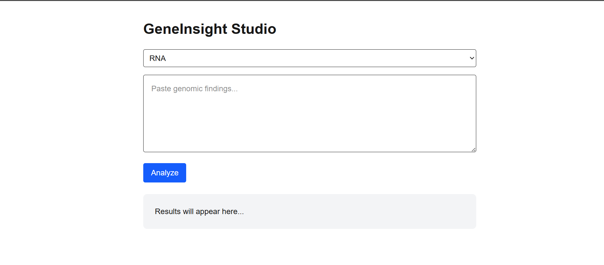
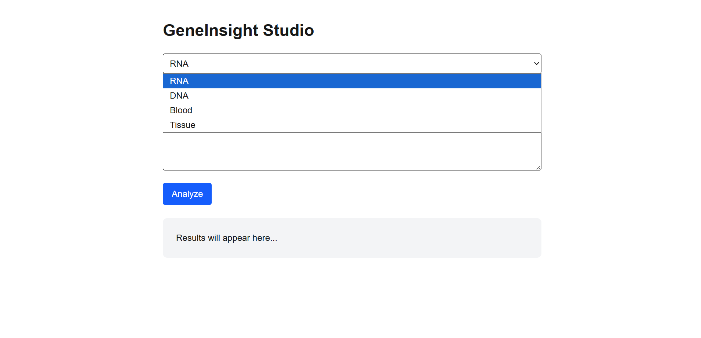
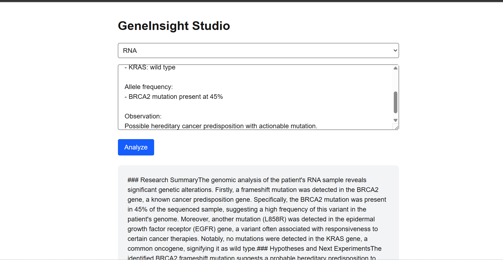

# 🧬 GeneInsight Studio
👉 **Live Production Demo:** [Open GeneInsight Studio](https://gene-insight-studio-4xh4.vercel.app/)

AI-powered genomics interpretation platform for modern biotech teams.

Transform raw experimental notes into structured biological insights, hypotheses, and regulatory-ready summaries in real time.

---

## Overview

GeneInsight Studio is a biotech-focused SaaS application designed to reduce the cognitive load of interpreting genomic and molecular biology data.

Researchers often deal with fragmented experimental outputs — gene expression results, variant lists, pathway signals — that require time-consuming analysis and translation into actionable insights.

This platform provides an end-to-end workflow:

* Capture experimental observations (genomics, sequencing, lab notes)
* Generate structured AI insights in real time
* Produce hypotheses and suggested next experiments
* Translate findings into regulatory or stakeholder-friendly summaries

---

## 🧬 Core Features

* **AI-powered genomics interpretation**

  * Uses OpenAI to analyze biological observations

* **Structured output with three sections**

  * Research Summary
  * Hypotheses & Next Experiments
  * Regulatory / Stakeholder Summary

* **Real-time streaming responses (SSE)**

  * Fast, incremental output rendering

* **Experiment input system**

  * Sample type selection (RNA, DNA, tissue, etc.)
  * Free-form experimental notes

* **Clean modular frontend**

  * Component-based architecture for scalability

---

## Product Experience

### Landing Page

* Clear value proposition for biotech use case
* CTA to enter the product workspace


### Experiment Workspace

* Input:

  * Sample type
  * Experimental observations
* One-click “Analyze” workflow
* Streaming AI output display


### Output Format

Each analysis produces:

#### 1. Research Summary

* Structured biological interpretation

#### 2. Hypotheses and Next Experiments

* Suggested biological mechanisms
* Recommended validations (e.g. sequencing, assays)

#### 3. Regulatory / Stakeholder Summary

* Simplified explanation
* Suitable for EMA-style or non-technical audiences


---

## 🏗 Architecture

Frontend (Next.js / React / TypeScript)
→ UI components + SSE client + state management

Backend (FastAPI / Python)
→ Prompt engineering + OpenAI integration + streaming response

AI Layer
→ Domain-specific prompt design for genomics and molecular biology

---

## ⚙️ Key Technical Decisions

### 1. Domain-Specific Prompt Engineering

Custom prompt tuned for:

* Genomics interpretation
* Experimental reasoning
* Regulatory communication

### 2. Streaming via Server-Sent Events (SSE)

* Improves perceived performance
* Enables real-time feedback loop

### 3. Modular Component Design

* Separation of input (ExperimentForm) and output (OutputViewer)
* Improves scalability and maintainability

### 4. Backend as Independent Service

* Decoupled from frontend
* Ready for containerization and cloud deployment

---

## Tech Stack

### Frontend

* Next.js (Pages Router)
* React + TypeScript
* Tailwind CSS
* @microsoft/fetch-event-source (SSE client)

### Backend

* FastAPI
* Uvicorn
* OpenAI Python SDK
* python-dotenv
* Pydantic

---

## 📁 Repository Structure

```
.
├── app/
│   ├── __init__.py
│   ├── server.py              # FastAPI backend
│   ├── models.py              # Request schemas
│   └── prompts/
│       ├── __init__.py
│       └── genomics.py        # Prompt logic
│
├── geneinsight-frontend/
│   ├── pages/
│   │   ├── index.tsx          # Landing page
│   │   ├── product.tsx        # Main app
│   │   ├── _app.tsx
│   │   └── _document.tsx
│   │
│   ├── components/
│   │   ├── ExperimentForm.tsx
│   │   └── OutputViewer.tsx
│   │
│   ├── styles/
│   │   └── globals.css
│   │
│   ├── public/
│   ├── package.json
│   └── next.config.ts
│
├── requirements.txt
├── Dockerfile
└── .env
```

---

## Environment Variables

Create a `.env` file in the root directory:

### Required

```
OPENAI_API_KEY=your_api_key_here
```

---

## Local Development

### 1. Install backend dependencies

```
pip install -r requirements.txt
```

Or:

```
pip install fastapi uvicorn openai python-dotenv pydantic
```

---

### 2. Run backend

```
python -m uvicorn app.server:app --reload --port 8000
```

Backend runs at:

```
http://localhost:8000
```

---

### 3. Install frontend dependencies

```
cd geneinsight-frontend
npm install
```

---

### 4. Run frontend

```
npm run dev
```

Frontend runs at:

```
http://localhost:3000
```

---

## 🐳 Docker Deployment

### Build image

```
docker build -t geneinsight:latest .
```

---

### Run container

```
docker run --rm -p 8000:8000 \
  -e OPENAI_API_KEY=your_api_key \
  geneinsight:latest
```

---

## 🔌 API Endpoints

### Analyze Experiment

```
POST /api/analyze
```

#### Request Body:

```
{
  "experiment_type": "Genomics",
  "sample_type": "RNA",
  "notes": "Experimental observations..."
}
```

#### Response:

* `text/event-stream`
* Streaming AI-generated output

---

### Health Check

```
GET /health
```

---

## 🔬 Example Use Cases

* RNA-seq differential expression analysis
* Variant interpretation (DNA sequencing)
* Infectious disease genomics
* CRISPR experiment analysis
* Pharmacogenomics insights

---

## Limitations

* AI output depends on input quality
* No real omics data integration (simulated inputs)
* No database persistence (yet)
* Not validated for clinical decision-making

---

## 🛣 Roadmap

* Experiment history persistence (SQLite/Postgres)
* Authentication (Clerk)
* Multi-user research workspaces
* Integration with bioinformatics pipelines
* Gene database enrichment (KEGG, Reactome)
* Export to PDF regulatory reports

---

## Disclaimer

This application assists with research interpretation and communication workflows.
It does not provide clinical diagnosis or treatment recommendations and should not replace expert biological or medical judgment.

---

## Vision

GeneInsight Studio explores how AI can bridge the gap between:

Raw biological data → Structured insight → Real-world decisions

By reducing interpretation time and improving clarity, it aims to accelerate innovation in biotech, both in advanced research environments and resource-constrained settings.
